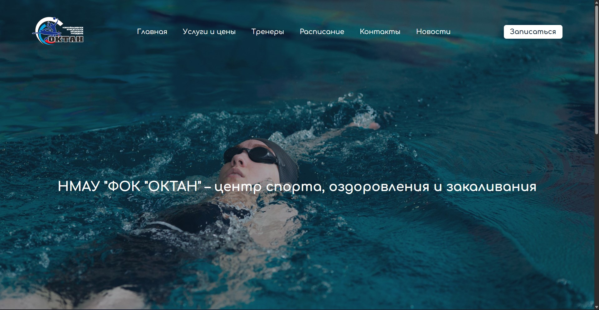
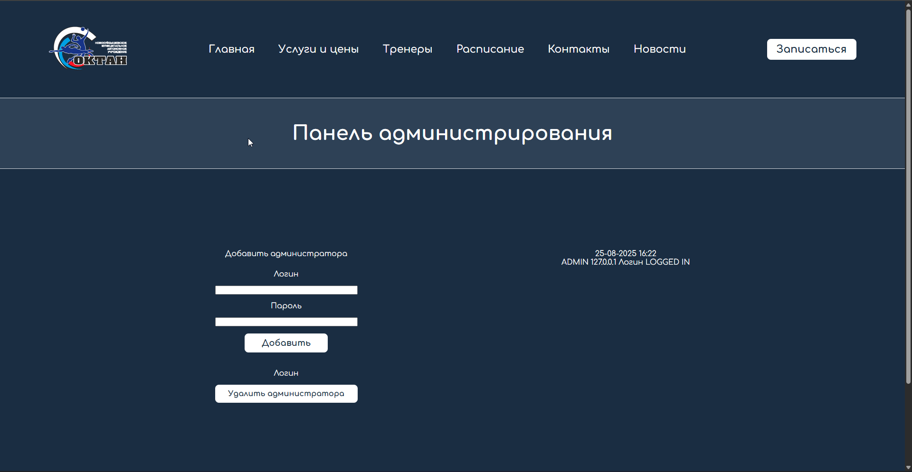
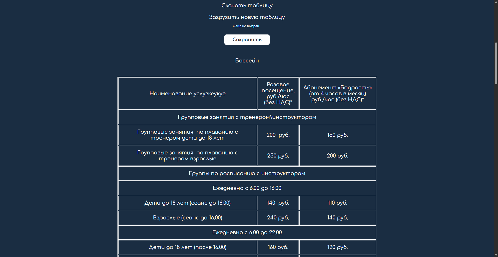
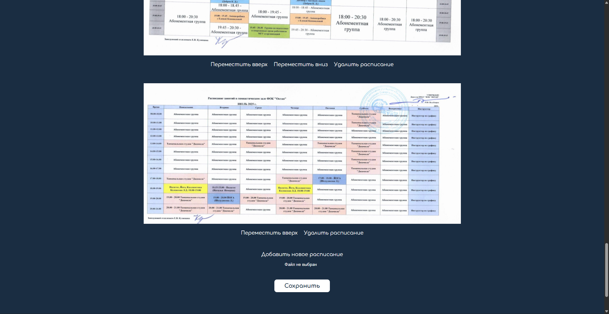
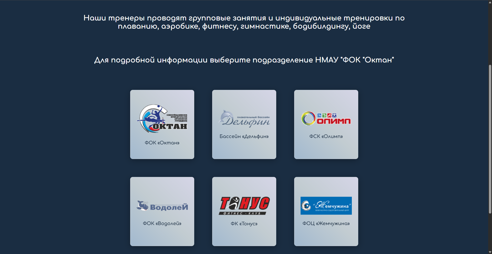
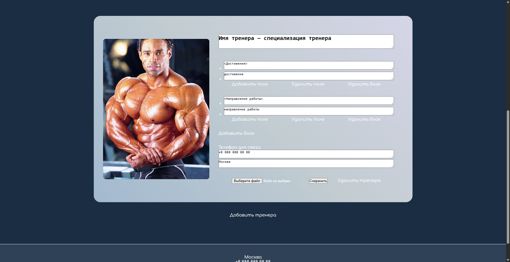
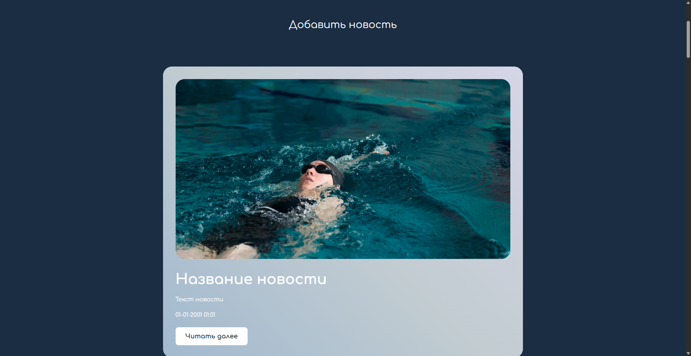

# flask-oktan

<div>
    
    
    
    
    
    
    
</div>

# About the project

Initially [zkqw3r](https://github.com/zkqw3r) suggested me to renew our local fitness company website, so there it is. Design and main architecture are made by [zkqw3r](https://github.com/zkqw3r), backend and some pages were made by me.

Site provides different pages about Fitness company, made on python with Flask, pandas and psycopg2, database is based on PostgreSQL. Site provides admin page, where you can edit most of the pages, adding and deleting admins, logging all admins' actions.

All pages except main page are customizable and can be modified on site with admin panel

**Services and prices** page is forming via excel file, which you can upload and download. Excel files are being used because it was initially used in the fitness company original website, but they used screenshots. So I decided, if they use Excel files, why don't do it better looking and easy to use.

**Schedule** page also uses screenshots, but it's almost impossible to look it nice using the same way, so I used photos instead

**Coaches** page are formed with PostreSQL database, which can be modified with admin panel on site. You can change coache's photo, name, phone and address and modify however you want his info blocks

**News** pages are built similar as **Coashes** page. News are sorted by date and are being autoloaded more if bottom of the page is reached

To visit admin page you should go to **/admin** url where you should login, login session lasts 15 minutes

All admins actions are logged to the database, the logs are stored for 100 days

# Main functions

- Viewing info about company
- Modifying pages with admin panel
- Logging all admins' actions

# Used in project

- Python 3.8+
- Flask - web framework
- Pandas - for working with excel files
- HTML, CSS, JavaScript

# Downloading and running the website

### 1. Download [Python](https://www.python.org/) and IDE

You can use any IDE you want, for example: PyCharm, VSCode, Python IDLE, etc.

### 2. Download ZIP or use git clone

```bash
git clone https://github.com/middelmatigheid/flask-oktan.git
cd flask-oktan
```

### 3. Create virtual environment

If you are using Linux/MacOS

```bash
python -m venv venv
source venv/bin/activate
```

If you are using Windows

```bash
python -m venv venv
venv\Scripts\activate 
```

### 4. Install requirements

```bash
pip install -r requirements.txt
```

### 5. Create .env file

Create .env file in the main directory and set up the values

```bash
HOST='YOUR HOST'
DBNAME='YOUR DBNAME'
USER='YOUR USERNAME'
PASSWORD='YOUR PASSWORD'
PORT=YOUR PORT
```

### 6. Run the website

```bash
python flask_app.py
```

Website would be available at http://127.0.0.1:5000 or http://localhost:5000

# Project structure

```bash
flask-oktan/
├── flask_app.py          # File for operating the website
├── database.py           # File for operating the database
├── templates/            # HTML templates
├── static/               
│   ├── css/              # CSS styles
│   ├── js/               # JavaScript files
│   ├── excel/            # Excel files
│   └── images/           
│       ├── basic/        # Basic images
│       ├── coaches/      # Coaches images
│       ├── schedules/    # Schedules images
│       └── news/         # News images
├── requirements.txt      # Python requirements
└── .env                  # Environment variables
```
